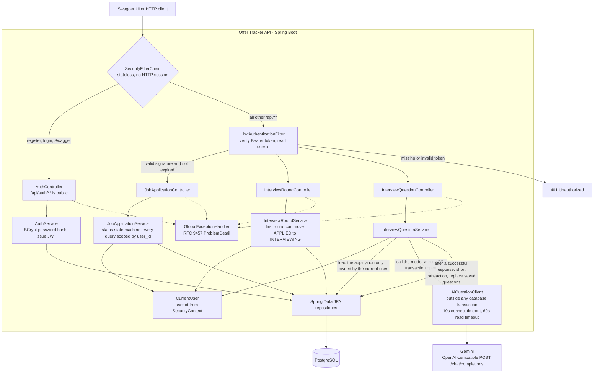
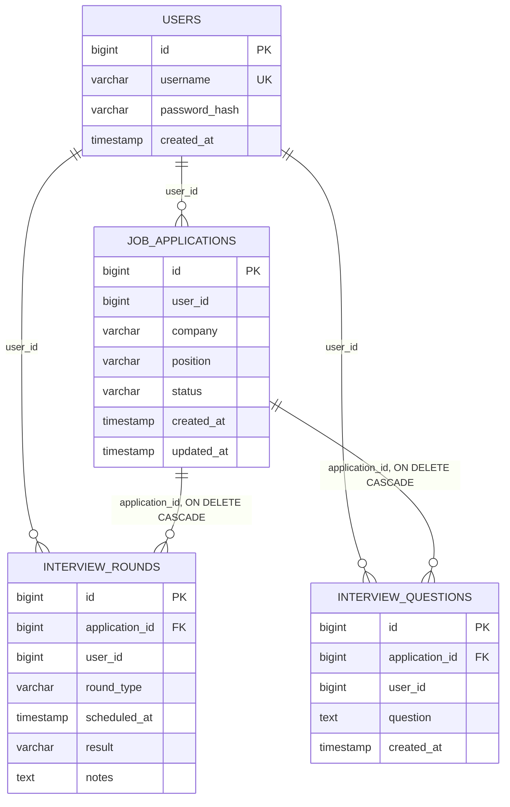

# Offer Tracker

REST API for tracking job applications: company, role, status, interview rounds, and AI-generated interview questions. Each user only sees their own data.

**Stack:** Java 17, Spring Boot, Spring Security, JWT, PostgreSQL, JPA/Hibernate, springdoc OpenAPI (Swagger).

## Features

- Job applications and interview rounds (one-to-many). Deleting an application deletes its rounds and questions via `ON DELETE CASCADE`.
- Status state machine: `APPLIED` → `INTERVIEWING` or `REJECTED`; `INTERVIEWING` → `OFFER` or `REJECTED`. `OFFER` and `REJECTED` are final. Illegal transitions return HTTP 409.
- Adding the first interview round to an `APPLIED` application moves it to `INTERVIEWING`.
- Filter by company (case-insensitive, partial match) and status, with pagination. Composite indexes on the filter and sort columns, checked with `EXPLAIN`.
- Stateless JWT authentication (HS512, 60-minute expiry) and BCrypt password hashing. Every query is scoped by `user_id`. Accessing another user's record returns 404.
- Generate interview questions from a job description through an OpenAI-compatible chat API (default: Gemini) and store them on that application. The model call runs outside a database transaction. Missing API key returns 503; upstream or parse failures return 502 and leave existing questions unchanged.
- Errors use RFC 9457 `ProblemDetail`. Interactive docs: Swagger UI.

## Request flow



## Data model



## API

| Method | Path | Auth |
| --- | --- | --- |
| POST | `/api/auth/register` | No |
| POST | `/api/auth/login` | No |
| POST | `/api/applications` | Yes |
| GET | `/api/applications` | Yes |
| GET | `/api/applications/{id}` | Yes |
| PUT | `/api/applications/{id}` | Yes |
| PATCH | `/api/applications/{id}/status` | Yes |
| DELETE | `/api/applications/{id}` | Yes |
| POST | `/api/applications/{id}/rounds` | Yes |
| GET | `/api/applications/{id}/rounds` | Yes |
| PUT | `/api/applications/{id}/rounds/{roundId}` | Yes |
| DELETE | `/api/applications/{id}/rounds/{roundId}` | Yes |
| POST | `/api/applications/{id}/questions` | Yes |
| GET | `/api/applications/{id}/questions` | Yes |

List applications: `GET /api/applications?company=goo&status=INTERVIEWING&page=0&size=20`. Page size is capped at 100.

Protected requests need `Authorization: Bearer <token>`.

## Run locally

**Prerequisites:** JDK 17, PostgreSQL, a database named `offer-tracker`.

**Environment variables** (Windows: System Properties → Environment Variables → User variables, then restart the IDE):

| Variable | Required | Purpose |
| --- | --- | --- |
| `DB_PASSWORD` | Yes | PostgreSQL password for user `postgres` |
| `JWT_SECRET` | Yes | HMAC signing key, at least 32 bytes. Example: `openssl rand -base64 48` |
| `AI_API_KEY` | No | LLM API key. If empty, the rest of the API still runs; question generation returns 503 |
| `AI_BASE_URL` | No | Default: `https://generativelanguage.googleapis.com/v1beta/openai` |
| `AI_MODEL` | No | Default: `gemini-3.5-flash-lite` |

Any OpenAI-compatible `/chat/completions` endpoint works. Override `AI_BASE_URL` and `AI_MODEL` to switch providers. Do not commit secrets.

```bash
./mvnw spring-boot:run
```

On Windows Command Prompt or PowerShell, use `mvnw.cmd` instead of `./mvnw`.

- Swagger UI: http://localhost:8080/swagger-ui/index.html
- OpenAPI JSON: http://localhost:8080/v3/api-docs

In Swagger, call **Register** or **Login**, copy `accessToken`, click **Authorize**, and paste the token without the `Bearer ` prefix.

`ddl-auto` is `update`, so Hibernate creates and updates tables on startup. Fine for local development; production schema changes should use a migration tool.

## Status rules

```text
APPLIED → INTERVIEWING → OFFER
   |            |
   +→ REJECTED ←+

OFFER and REJECTED cannot change.
```

## Project layout

```text
controller   HTTP and validation
service      business rules (status machine, ownership checks)
repository   Spring Data JPA
entity       tables
dto          request and response bodies
security     JWT filter, token service, current user
ai           LLM client
```